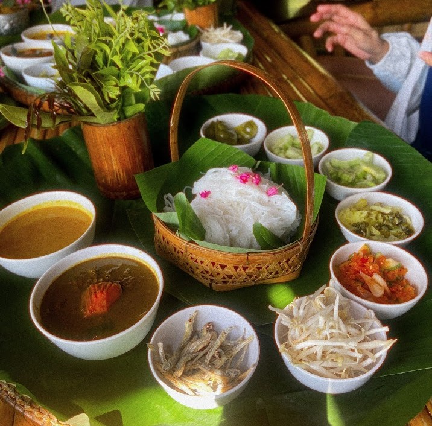

# About Me

<b>TL;DR</b>  
I aspire to develop real-time interactive tools and software for creatives and engineers in areas related to computer graphics.

---

I am an undergraduate student majoring in computer science at Mahidol University. Although I'm pivoting away from a career focused on design and technical art, my passion remains in computer graphics. 

Currently, I'm particularly interested in <mark>visualization, simulation, tooling, and computer aided design applications for real-time and offline productions.</mark>

Other things that I like doing outside of computers and art is cooking, binging albums, horror games, a hike in nature and sipping on ice cold ชามะนาว.

<!-- ---
Growing up in South Africa I always had these interests clash, I was drawn to the arts but I was also drawn to the maths and sciences. I was fascinated to know how things were made, I always watched the extras on all the DVDs I had at home and binged the hell out of How Its Made on the Discovery channel. I loved creation and how math and sciences were the means of doing that. However there was this notion growing up that these interests were to be separate. Attempting of having a deep interest in both were seen as counterproductive or unrealistic. Yet to me it always made sense that having a deep interest in both the arts and STEM could coexist and even intersect each other in interesting ways.
--- -->

## Experience



> While I won't display my prior design work here, you can find them on my [Behance](https://www.behance.net/austinmaddison) portfolio. 

## FAQ
### What is your favorite show?
**Severance**. It's so weird, sci-fi and full of questions. It's also beautifully filmed, especially for a show set mostly in eerily clinical white rooms.  

{}

### What can you eat everyday?
ขนมจีนแกงไตปลา

<!-- ### Who inspires you?

Besides all the amazing people in my life: family, friends, mentors and ajarns here are some people and places that really make me go wow, I want to do something like that.

**Some Heros (People and Studios)**:  
[Wolfgang Engel](https://diaryofagraphicsprogrammer.blogspot.com/)  
[Inigo Quilez](https://iquilezles.org/)   
[Krzysztof Narkowicz](https://knarkowicz.wordpress.com/)   
[Morhan McGuire]()  
[Eric Haines]()   
[Tomas Möller]()   
[Mat "MJP"]()  
[John Chapman](https://john-chapman.github.io/)     
[Santa Monica Studios](https://sms.playstation.com/)   
[Man Vs Machine](https://mvsm.com/)  
[Remedy](https://www.remedygames.com/article/gdc2024) *Did I mention I love Remedy?*  
[Weta Digital/FX](https://www.wetafx.co.nz/)
and many more... -->

### How was this site made?
I use a static site generator [Hugo](https://gohugo.io/) with my own custom theme.  