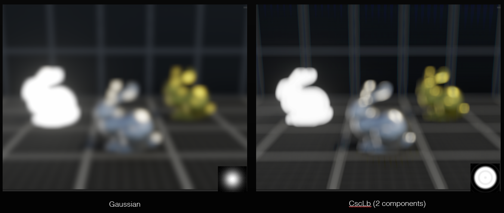

{}

<video autoplay loop muted playsinline >
  <source src="thumbnail.webm" type="video/webm">
</video>

<div class="h-5"></div>

I have always been intrigued by lens simulation and post process effects in games and movies. One of the most important lens effect to emulate is camera lens blur (also known as bokeh depth of field). Lense blur is usually used isolate subject matter or exagerate depth in a scene. In real life, the charactersistics of the lens blur is highly depenedant on the lens, more specifically the configuration of glass elements inside the lens's housing. 

You can read more about the topic from Silicon Studio's RND Presentations on Real-time Rendering of Physically Based Optical Effect in Theory and Practice [here](https://www.siliconstudio.co.jp/en/rd/presentations/).

For renderers such as ray-tracers and path-tracers this effect can simulated when rendering while realtime methods it is usually a post process.

## Gather and Scatter
Solutions to achieving lens blur are categorized into either a gather or scatter solutions. Some modern methods use a hybrid of both. The gather runs convolution kernel over the target image while a scatter solution literally scatters quads with a bokeh texture over the target image. Both methods have unique tradeoffs, I think there is an obscure Epic Game's talk on the topic. From now onwards I will be discussing just about gather solutions.

## Whats wrong with gather? 
Unlike gaussian blur which is seperable, a circular blur was thought to not be able to be serperable too. Gather based methods have that are not seperable have \(O(n^2)\) time complexity.

However developers at EA proposed that we could use an imaginary component to construct a circular blur and supporting seperability.


## Inital tests in MATLAB
I used MATLAB's GPU arrays for testing wheteher I could implement what is described in the paper.


## Implementation in Unity
Unity's universal render pipeline (URP) allows us to create a renderer feature to implement post-processing effects. 


```cs
using UnityEngine.Rendering.Universal;

public class CscLensBlurRendererFeature : ScriptableRendererFeature
{
    CscLensBlurRenderPass cscLensBlurRenderPass;

    public override void Create()
    {
        cscLensBlurRenderPass = new CscLensBlurRenderPass();
        name = "CscLensBlur";
    }

    public override void AddRenderPasses(ScriptableRenderer renderer, ref RenderingData renderingData)
    {
        if(cscLensBlurRenderPass.Setup(renderer))
        {
            renderer.EnqueuePass(cscLensBlurRenderPass);
        }
    }
}
```

The renderer feature takes a render pass which executes the fucntions that run the shaders over the input image.

```cs
public class CscLensBlurRenderPass : ScriptableRenderPass
{
  //...
  public override void Execute(ScriptableRenderContext context, ref RenderingData renderingData)
  {
    if (blurSettings == null || !blurSettings.IsActive())
      return;

    CommandBuffer cmd = CommandBufferPool.Get("Csc Blur Blur Post Process");

    material.SetFloat("_Spread", blurSettings.strength.value);

    // Horizontal
    cmd.Blit(source, horizontalPassTexR, material, 0);
    cmd.Blit(source, horizontalPassTexG, material, 1);
    cmd.Blit(source, horizontalPassTexB, material, 2);
    cmd.Blit(source, horizontalPassTexW, material, 3);

    cmd.Blit(horizontalPassTexR, renderTexR);
    cmd.Blit(horizontalPassTexG, renderTexG);
    cmd.Blit(horizontalPassTexB, renderTexB);
    cmd.Blit(horizontalPassTexW, renderTexW);

    material.SetTexture("_TexR", renderTexR);
    material.SetTexture("_TexG", renderTexG);
    material.SetTexture("_TexB", renderTexB);
    material.SetTexture("_TexW", renderTexW);

    cmd.Blit(null, source, material, 4);

    context.ExecuteCommandBuffer(cmd);
    cmd.Clear();
    CommandBufferPool.Release(cmd);
  }
  //...
}

```

This is the shader that the material is made from.
```c
/* -------------------------------------------------------------------------- */
/*                  Circurlarly Seperable Convolutional Blur                  */
/* -------------------------------------------------------------------------- */

Shader "PostProcessing/CscLensBlur"
{
    Properties
    {
		_MainTex ("Base (RGB)", 2D) = "white" { }
		_Spread("Standard Deviation (Spread)", Float) = 0
		_TexR("Buffer R", 2D) = "black" { }
    	_TexG("Buffer G", 2D) = "black" { }
    	_TexB("Buffer B", 2D) = "black" { }
    	_TexW("Buffer Weight", 2D) = "black" { }
    }
    SubShader
    {
        Tags
		{
			"RenderType" = "Opaque"
			"RenderPipeline" = "UniversalPipeline"
		}

		HLSLINCLUDE

		#include "Packages/com.unity.render-pipelines.universal/ShaderLibrary/Core.hlsl"
		#define E 2.71828f

		sampler2D _MainTex;
		sampler2D _TexR;
		sampler2D _TexG;
		sampler2D _TexB;
		sampler2D _TexW;

		CBUFFER_START(UnityPerMaterial)
			float4 _MainTex_TexelSize;
			float _Spread;
		CBUFFER_END

		struct appdata
		{
			float4 positionOS : Position;
			float2 uv : TEXCOORD0;
		};

		struct v2f
		{
			float4 positionCS : SV_Position;
			float2 uv : TEXCOORD0;
		};

		v2f vert(appdata v)
		{
			v2f o;
			o.positionCS = TransformObjectToHClip(v.positionOS.xyz);
			o.uv = v.uv;
			return o;
		}

		// The precomputed CSC Real and Imaginary Kernel's from the paper referenced in the projects proposal: https://dl.acm.org/doi/10.1145/3084363.3085022.
		#define KERNEL_RADIUS 8
		#define KERNEL_COUNT 17

		/* ------------- 2-Component (For Far Field Blur, More Precise) ------------- */
		static const float4 Kernel0BracketsRealXY_ImZW_2 = float4(-0.038708,0.943062,-0.025574,0.660892);
		static const float2 Kernel0Weights_RealX_ImY_2 = float2(0.411259,-0.548794);
		static const float4 Kernel0_RealX_ImY_RealZ_ImW_2[] = {
				float4(/*XY: Non Bracketed*/0.014096,-0.022658,/*Bracketed WZ:*/0.055991,0.004413),
				float4(/*XY: Non Bracketed*/-0.020612,-0.025574,/*Bracketed WZ:*/0.019188,0.000000),
				float4(/*XY: Non Bracketed*/-0.038708,0.006957,/*Bracketed WZ:*/0.000000,0.049223),
				float4(/*XY: Non Bracketed*/-0.021449,0.040468,/*Bracketed WZ:*/0.018301,0.099929),
				float4(/*XY: Non Bracketed*/0.013015,0.050223,/*Bracketed WZ:*/0.054845,0.114689),
				float4(/*XY: Non Bracketed*/0.042178,0.038585,/*Bracketed WZ:*/0.085769,0.097080),
				float4(/*XY: Non Bracketed*/0.057972,0.019812,/*Bracketed WZ:*/0.102517,0.068674),
				float4(/*XY: Non Bracketed*/0.063647,0.005252,/*Bracketed WZ:*/0.108535,0.046643),
				float4(/*XY: Non Bracketed*/0.064754,0.000000,/*Bracketed WZ:*/0.109709,0.038697),
				float4(/*XY: Non Bracketed*/0.063647,0.005252,/*Bracketed WZ:*/0.108535,0.046643),
				float4(/*XY: Non Bracketed*/0.057972,0.019812,/*Bracketed WZ:*/0.102517,0.068674),
				float4(/*XY: Non Bracketed*/0.042178,0.038585,/*Bracketed WZ:*/0.085769,0.097080),
				float4(/*XY: Non Bracketed*/0.013015,0.050223,/*Bracketed WZ:*/0.054845,0.114689),
				float4(/*XY: Non Bracketed*/-0.021449,0.040468,/*Bracketed WZ:*/0.018301,0.099929),
				float4(/*XY: Non Bracketed*/-0.038708,0.006957,/*Bracketed WZ:*/0.000000,0.049223),
				float4(/*XY: Non Bracketed*/-0.020612,-0.025574,/*Bracketed WZ:*/0.019188,0.000000),
				float4(/*XY: Non Bracketed*/0.014096,-0.022658,/*Bracketed WZ:*/0.055991,0.004413)
		};
		static const float4 Kernel1BracketsRealXY_ImZW_2 = float4(0.000115,0.559524,0.000000,0.178226);
		static const float2 Kernel1Weights_RealX_ImY_2 = float2(0.513282,4.561110);
		static const float4 Kernel1_RealX_ImY_RealZ_ImW_2[] = {
				float4(/*XY: Non Bracketed*/0.000115,0.009116,/*Bracketed WZ:*/0.000000,0.051147),
				float4(/*XY: Non Bracketed*/0.005324,0.013416,/*Bracketed WZ:*/0.009311,0.075276),
				float4(/*XY: Non Bracketed*/0.013753,0.016519,/*Bracketed WZ:*/0.024376,0.092685),
				float4(/*XY: Non Bracketed*/0.024700,0.017215,/*Bracketed WZ:*/0.043940,0.096591),
				float4(/*XY: Non Bracketed*/0.036693,0.015064,/*Bracketed WZ:*/0.065375,0.084521),
				float4(/*XY: Non Bracketed*/0.047976,0.010684,/*Bracketed WZ:*/0.085539,0.059948),
				float4(/*XY: Non Bracketed*/0.057015,0.005570,/*Bracketed WZ:*/0.101695,0.031254),
				float4(/*XY: Non Bracketed*/0.062782,0.001529,/*Bracketed WZ:*/0.112002,0.008578),
				float4(/*XY: Non Bracketed*/0.064754,0.000000,/*Bracketed WZ:*/0.115526,0.000000),
				float4(/*XY: Non Bracketed*/0.062782,0.001529,/*Bracketed WZ:*/0.112002,0.008578),
				float4(/*XY: Non Bracketed*/0.057015,0.005570,/*Bracketed WZ:*/0.101695,0.031254),
				float4(/*XY: Non Bracketed*/0.047976,0.010684,/*Bracketed WZ:*/0.085539,0.059948),
				float4(/*XY: Non Bracketed*/0.036693,0.015064,/*Bracketed WZ:*/0.065375,0.084521),
				float4(/*XY: Non Bracketed*/0.024700,0.017215,/*Bracketed WZ:*/0.043940,0.096591),
				float4(/*XY: Non Bracketed*/0.013753,0.016519,/*Bracketed WZ:*/0.024376,0.092685),
				float4(/*XY: Non Bracketed*/0.005324,0.013416,/*Bracketed WZ:*/0.009311,0.075276),
				float4(/*XY: Non Bracketed*/0.000115,0.009116,/*Bracketed WZ:*/0.000000,0.051147)
		};

		/* --------------- 1-Component (Near Field Blur Less Precise) --------------- */
		static const float4 Kernel0BracketsRealXY_ImZW_1 = float4(-0.001442,0.672786,0.000000,0.311371);
		static const float2 Kernel0Weights_RealX_ImY_1 = float2(0.767583,1.862321);
		static const float4 Kernel0_RealX_ImY_RealZ_ImW_1[] = {
				float4(/*XY: Non Bracketed*/-0.001442,0.026656,/*Bracketed WZ:*/0.000000,0.085609),
				float4(/*XY: Non Bracketed*/0.010488,0.030945,/*Bracketed WZ:*/0.017733,0.099384),
				float4(/*XY: Non Bracketed*/0.023771,0.030830,/*Bracketed WZ:*/0.037475,0.099012),
				float4(/*XY: Non Bracketed*/0.036356,0.026770,/*Bracketed WZ:*/0.056181,0.085976),
				float4(/*XY: Non Bracketed*/0.046822,0.020140,/*Bracketed WZ:*/0.071737,0.064680),
				float4(/*XY: Non Bracketed*/0.054555,0.012687,/*Bracketed WZ:*/0.083231,0.040745),
				float4(/*XY: Non Bracketed*/0.059606,0.006074,/*Bracketed WZ:*/0.090738,0.019507),
				float4(/*XY: Non Bracketed*/0.062366,0.001584,/*Bracketed WZ:*/0.094841,0.005086),
				float4(/*XY: Non Bracketed*/0.063232,0.000000,/*Bracketed WZ:*/0.096128,0.000000),
				float4(/*XY: Non Bracketed*/0.062366,0.001584,/*Bracketed WZ:*/0.094841,0.005086),
				float4(/*XY: Non Bracketed*/0.059606,0.006074,/*Bracketed WZ:*/0.090738,0.019507),
				float4(/*XY: Non Bracketed*/0.054555,0.012687,/*Bracketed WZ:*/0.083231,0.040745),
				float4(/*XY: Non Bracketed*/0.046822,0.020140,/*Bracketed WZ:*/0.071737,0.064680),
				float4(/*XY: Non Bracketed*/0.036356,0.026770,/*Bracketed WZ:*/0.056181,0.085976),
				float4(/*XY: Non Bracketed*/0.023771,0.030830,/*Bracketed WZ:*/0.037475,0.099012),
				float4(/*XY: Non Bracketed*/0.010488,0.030945,/*Bracketed WZ:*/0.017733,0.099384),
				float4(/*XY: Non Bracketed*/-0.001442,0.026656,/*Bracketed WZ:*/0.000000,0.085609)
		};
		ENDHLSL
        Pass
        {
			Name "R"
           
			// CGPROGRAM
			// SetTexture[_MainTex]
			// ENDCG

		   	HLSLPROGRAM
            #pragma vertex vert
            #pragma fragment frag_horizontal

            float4 frag_horizontal (v2f i) : SV_Target
			{

				float4 valR = float4(0.0f, 0.0f, 0.0f, 0.0f);
				
				float coc = _Spread; // Circle of confusion.
	
				for (int x = 0; x <= KERNEL_RADIUS * 2; ++x)
				{
					int index = x - KERNEL_RADIUS;
					float2 coords = i.uv + _MainTex_TexelSize * float2(float(index), 0.0f) * coc;
					
					float2 c0 = Kernel0_RealX_ImY_RealZ_ImW_2[index + KERNEL_RADIUS].xy;
					float2 c1 = Kernel1_RealX_ImY_RealZ_ImW_2[index + KERNEL_RADIUS].xy;

					float3 texel = tex2D(_MainTex, coords).rgb;

					// Apply kernel weights
					valR += float4(texel.r * c0, texel.r * c1);
				}

				return valR;
			}
            ENDHLSL
        }

		Pass
        {
			Name "G"
           
			// CGPROGRAM
			// SetTexture[_MainTex]
			// ENDCG

		   	HLSLPROGRAM
            #pragma vertex vert
            #pragma fragment frag_horizontal

            float4 frag_horizontal (v2f i) : SV_Target
			{
				float4 valG = float4(0.0f, 0.0f, 0.0f, 0.0f);
				
				float coc = _Spread; // Circle of confusion.
	
				for (int x = 0; x <= KERNEL_RADIUS * 2; ++x)
				{
					int index = x - KERNEL_RADIUS;
					float2 coords = i.uv + _MainTex_TexelSize * float2(float(index), 0.0f) * coc;
					
					float2 c0 = Kernel0_RealX_ImY_RealZ_ImW_2[index + KERNEL_RADIUS].xy;
					float2 c1 = Kernel1_RealX_ImY_RealZ_ImW_2[index + KERNEL_RADIUS].xy;

					float3 texel = tex2D(_MainTex, coords).rgb;

					// Apply kernel weights
					valG += float4(texel.g * c0, texel.g * c1);
				}
				return valG;
			}
            ENDHLSL
        }

		Pass
        {
			Name "B"
           
			// CGPROGRAM
			// SetTexture[_MainTex]
			// ENDCG

		   	HLSLPROGRAM
            #pragma vertex vert
            #pragma fragment frag_horizontal

            float4 frag_horizontal (v2f i) : SV_Target
			{

				float4 valB = float4(0.0f, 0.0f, 0.0f, 0.0f);
				
				float coc = _Spread; // Circle of confusion.
	
				for (int x = 0; x <= KERNEL_RADIUS * 2; ++x)
				{
					int index = x - KERNEL_RADIUS;
					float2 coords = i.uv + _MainTex_TexelSize * float2(float(index), 0.0f) * coc;
					
					float2 c0 = Kernel0_RealX_ImY_RealZ_ImW_2[index + KERNEL_RADIUS].xy;
					float2 c1 = Kernel1_RealX_ImY_RealZ_ImW_2[index + KERNEL_RADIUS].xy;

					float3 texel = tex2D(_MainTex, coords).rgb;

					// Apply kernel weights
					valB += float4(texel.b * c0, texel.b * c1);
				}

				return valB;
			}
            ENDHLSL
        }

				Pass
        {
			Name "W"
           
			// CGPROGRAM
			// SetTexture[_MainTex]
			// ENDCG

		   	HLSLPROGRAM
            #pragma vertex vert
            #pragma fragment frag_horizontal

            float frag_horizontal (v2f i) : SV_Target
			{
				float kernelSum = 0.0f;
				float coc = _Spread; // Circle of confusion.
	
				for (int x = 0; x <= KERNEL_RADIUS * 2; ++x)
				{
					kernelSum += coc;
				}

				return kernelSum / (KERNEL_COUNT);
			}
            ENDHLSL
        }


		Pass
        {
			Name "Comp"
            HLSLPROGRAM
            #pragma vertex vert
            #pragma fragment frag_vertical

			float2 multComplex(float2 p, float2 q)
			{
				return float2(p.x*q.x-p.y*q.y, p.x*q.y+p.y*q.x);
			}

            float4 frag_vertical (v2f i) : SV_Target
			{
				float4 filteredColor = float4(0, 0, 0, 0);

				float4 valR = float4(0,0,0,0);
				float4 valG = float4(0,0,0,0);
				float4 valB = float4(0,0,0,0);

				float weightValue = 0;
				float coc = _Spread; // Circle of confusion.

				for (int y = 0; y <= KERNEL_RADIUS * 2; ++y)
				{
					int index = y - KERNEL_RADIUS;
					float2 coords = i.uv + _MainTex_TexelSize * float2(0.0f,  float(index)) * coc;
					
					float weightValueSample = tex2D(_TexW, coords).r;
					weightValue += weightValueSample;
					
					float4 imageTexelR = tex2D(_TexR, coords);  
					float4 imageTexelG = tex2D(_TexG, coords);  
					float4 imageTexelB = tex2D(_TexB, coords);  

					float2 c0 = Kernel0_RealX_ImY_RealZ_ImW_2[index + KERNEL_RADIUS].xy;
					float2 c1 = Kernel1_RealX_ImY_RealZ_ImW_2[index + KERNEL_RADIUS].xy;

					valR.xy += multComplex(imageTexelR.xy, c0);
					valR.zw += multComplex(imageTexelR.zw, c1);

					valG.xy += multComplex(imageTexelG.xy, c0);
					valG.zw += multComplex(imageTexelG.zw, c1);

					valB.xy += multComplex(imageTexelB.xy, c0); 
					valB.zw += multComplex(imageTexelB.zw, c1); 
				}

				weightValue /= (KERNEL_COUNT);
				float redChannel   = dot(valR.xy,Kernel0Weights_RealX_ImY_2) + dot(valR.zw,Kernel1Weights_RealX_ImY_2);
				float greenChannel = dot(valG.xy,Kernel0Weights_RealX_ImY_2) + dot(valG.zw,Kernel1Weights_RealX_ImY_2);
				float blueChannel  = dot(valB.xy,Kernel0Weights_RealX_ImY_2) + dot(valB.zw,Kernel1Weights_RealX_ImY_2);
				return float4((float3(redChannel, greenChannel, blueChannel) / weightValue), 1.0f);
			}
            ENDHLSL
        }
		
    }
}

```


## Results




## Code Repository
[GitHub Repository Link](https://github.com/AustinMaddison/CocLb/tree/master)

## References
https://www.ea.com/frostbite/news/circular-separable-convolution-depth-of-field