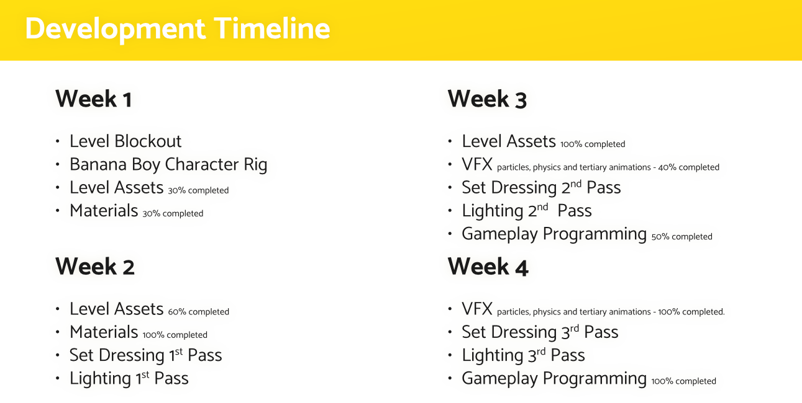
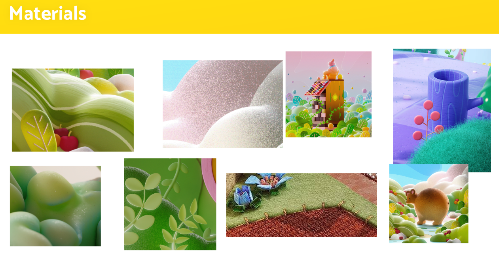
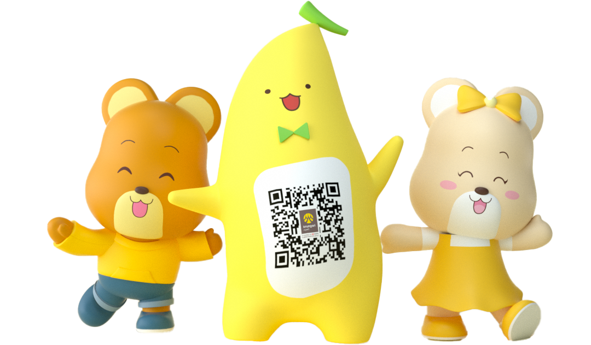
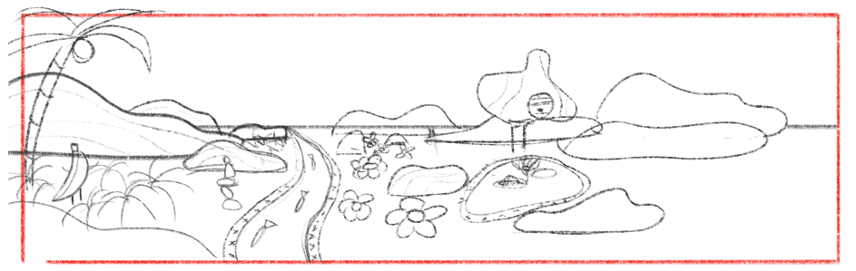

{}

{}

<iframe class="w-full" height="330px" src="https://www.youtube.com/embed/hmK6vug5r68?si=IfmBeWxxLIpL46_o" title="YouTube video player" frameborder="0" allow="accelerometer; autoplay; clipboard-write; encrypted-media; gyroscope; picture-in-picture; web-share" referrerpolicy="strict-origin-when-cross-origin" allowfullscreen></iframe>

#### Lookdev Stills

#### Lookdev + Animation Test

<video autoplay loop muted playsinline controls>
  <source src="lookdev.mp4" type="video/mp4">
</video>

<video autoplay loop muted playsinline controls>
  <source src="lookdev-left.mp4" type="video/mp4">
</video>

<video autoplay loop muted playsinline controls>
  <source src="lookdev-right.mp4" type="video/mp4">
</video>

   
    I called the demo Banana Boy but the project was named to Hello Mascot to be more generic for thier product portfolio's market. 
    

# Introduction
This project began last year in my first internship at Adapter Digital. They are a digital agency based in Bangkok. How I landed the internship is actually a funny story.  

## The Interview
 Initially a recruitment team approached me with a creative tech / 3D motion designer position, I asked if I could get an internship instead because I was a full-time student. When I was interviewed by the people running the creative/innovation lab they were surprised to learn that I was still in my first year of university because they really liked my work on behance. 

The interview was great. It was the first time I had a conversation with somebody who understood the craft as much as I did, and it felt amazing to connect with someone on that level. The interview was lengthy, and I believe we enjoyed every minute of it. That is how I got the internship.

## Moving to Bangkok
While my university dorm was in Nakhon Pathom, not far from Bangkok, my roots in Phuket made me accustomed to feeling isolated in my interests in computers, art, and technology. Discovering Bangkok's vibrant tech, engineering, and art scene was a revelation. Finally finding a community that shared some of my passions was an incredible feeling of connection.

# The Brief
Real estate development project (The Forestias) would like a new interesting way to elevate the experience of their public spaces. One of the ways is with interactive experiences with their area assigned mascots. The constraints of this interactive experience is that it will be an installation. The installation consists of 16:3 (1080x5760 pixels) screen and a single motion capture camera. The demo that will be running on the installation will be using the Krungsri banana mascot because the studio had the original rig for it already and the character has no copyright. Lastly, the technology we must use is Unity. 

## Pre-Production
Consisted of brainstorming, research and planning. Here are some screenshots.

# Production
## Character
I was given the source files for krungsri's banana character. I immediately realized that the rig provided would not be suitable for the project. Its topology, UVs and polygonal density would make it suboptimal for rendering in realtime on a large screen. So I had to make my own.

### Source Character Rig

  

    
  

  

    
  

### My Rig + Run Animation

<video autoplay loop muted playsinline controls>
  <source src="rig.mp4" type="video/mp4">
</video>

### LookDev

<video autoplay loop muted playsinline controls>
  <source src="rig-lookdev.mp4" type="video/mp4">
</video>

### Face shader

    <video width="350px" autoplay loop muted playsinline controls class="mx-auto" >
      <source src="face-demo.mp4" type="video/mp4">
    </video>

What is interesting about the character's shaders is the shader that drives the character's face. The scheduling of the blinks and mouth shapes are totally driven by wave functions. The CPU at anytime can interrupt and override a specific eye + mouth expression on an event. I did not take a screenshot nor have to correct development environment at home to open the project file so for now I will just give a gist on how it works. The expressions for the mouth and eyes are indexed and multiple sin cos, modulos functions are manually tuned and combined to get the desired index over time mouth and eye shapes. Then the face shader is composited onto the body's base claymation shader. Maybe in a future article I write how I made the shaders for the character.

#### Mouths

#### Eyes

## Environment
### Concept
So I made a sketch, it isn't amazing by any means but it provides some guidance on what props shaders, and materials will the scene need as well as the loose placement and overall composition of everything. Also gives opportunity to decide where to put interactive events in the level for the gameplay.

### Blockout

Blocking out is super duper important, allows me to use proxies to establish volume, proportions, and composition of the scene early on. That way when I start creating the props I have a better understanding on scale, variation, level of detail etc. Also when its time to set dress, the outcome is predictable. Another great bonus of having a blockout it works as a great sandbox for programming the gameplay because it abstracts all the visual noise and complex assets away.  

### Timelapse
<video autoplay loop muted playsinline controls>
  <source src="timelapse.mp4" type="video/mp4">
</video>

## Set Dressing
### Hero Props
#### Flowers
#### Coconut Tree
#### Fish
#### Rocks
#### Statue

### Secondary Props
#### Clouds
#### River
#### Vegetation
##### Trees
##### Grass
#### Hills

## Materials and Shaders
I was heavily inspired by some of the stylized platformer games, some I even grew up on such as my little planet. I loved how tactile all the materials were in these games. 

You could immediately read exactly what each material might feel like in my little planet. The cardboard, plastic, felt cloth, stitching, metallic joinery and so on. Every surface had a material description comprehensive enough to communicate to the player exactly what an object was made out of. It really grounded the visuals you saw on screen to reality, emphasizing this notion of a window of sorts. I wanted to incorporate a similar level of tactileness to into my materials and shaders to give a similar window into shoebox effect.  

### Substance Designer
### Wind Vertex Shader

## Dialogue Boxes

## Player Interaction
### Mocap
### Google API
### Extracting Essential Data

# Conclusion
## Wish there was more time.
## References