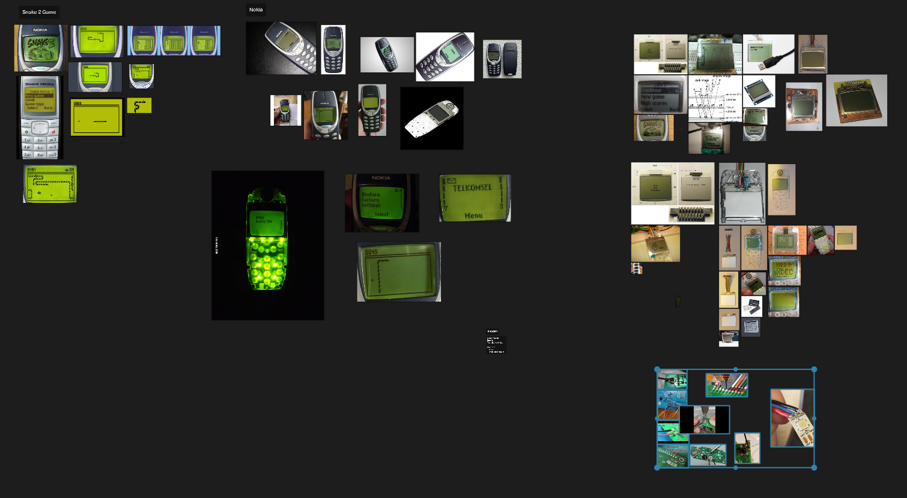

{}

<video autoplay loop muted playsinline >
  <source src="thumbnail.webm" type="video/webm">
</video>

I have always been obsessed on how different materials respond under different conditions. LCDs are no exception. My friend reccomended me to try a relativley new game engine on the block, Godot 3.2. During my summer break I decided to give thier shader authoring system and rendering features for a spin. 

I wanted to recreate the iconic snake game on the Nokia. I wanted it to be in 3D. I knew I had to craft an authentic looking LCD sceen or it wouldn't look quite right. More specifically a monochrome Passive Matrix LCD.

# Gathering Reference
The LCD I wanted to emulate belonged to the Nokia 3310. I gathered a bunch of reference images off the internet to understand all the nuances this specific phone screen had.

I collected images the nokia device, the snake game and the isolated screen module with and without the backlight on. Thanfully the community of tinkerers in the past have documented lots of images of this LCD.

## Visual Features
These are the visual features that I noticed that are key in portraying this LCD as faitlfully I possibly can.

## Substrate

## Shadow Parralax

## Contact Shadow

## Backlight Sparkle

## Backlight

## Imperfection Top Coat

## Github Repository
https://github.com/AustinMaddison/Nokia-Sim/tree/master

## References
