{}

<video autoplay loop muted playsinline >
  <source src="thumbnail.webm" type="video/webm">
</video>

<div class="h-5"></div>

I have always been fascinated by how different materials respond under various conditions, and LCDs are no exception. A friend recommended that I try a relatively new game engine on the block, [Godot 4.3](https://godotengine.org/releases/4.3/). During my summer break, I decided to give its shader authoring system and rendering features a spin.  

I aimed to recreate the iconic Snake game from Nokia phones but in 3D. To achieve this, I knew I had to craft an authentic-looking LCD screen; otherwise, it just wouldn't feel right. More specifically, I wanted to simulate a monochrome passive matrix LCD.

# Gathering Reference
The LCD I wanted to emulate belonged to the Nokia 3310. I gathered a bunch of reference images off the internet to understand all the nuances this specific phone screen had.


I collected images the nokia device, the snake game and the isolated screen module with and without the backlight on. Thankfully the community of tinkerers in the past have documented lots of images of this LCD.

## Visual Features
These are the key visual features I’ve spotted that are essential for portraying this LCD as faithfully as possible.

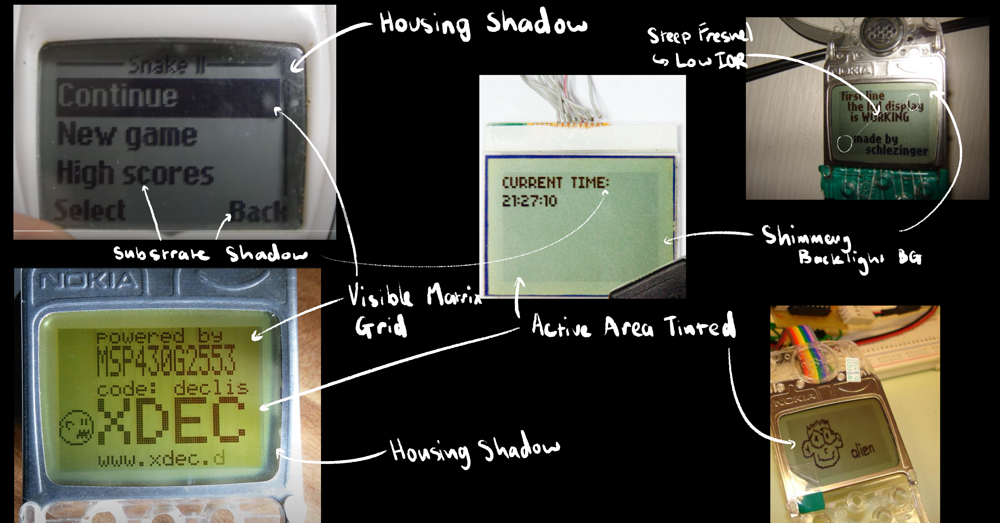
I’ve been curious if anyone has formally written about a visual phenomenon I noticed shadows cast by the substrate onto the transflector. I remember seeing the same effect on my G-Shock as a kid.

<div class="grid sm:grid-cols-2 my-4">
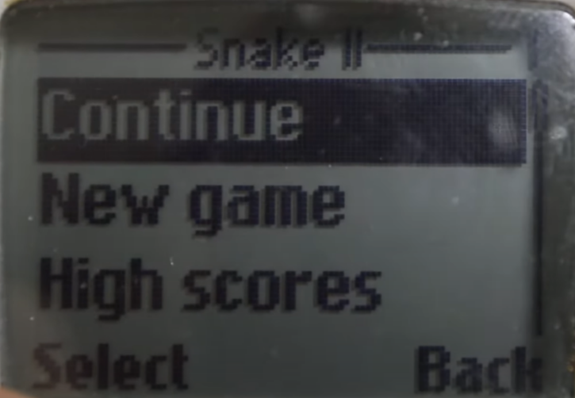 
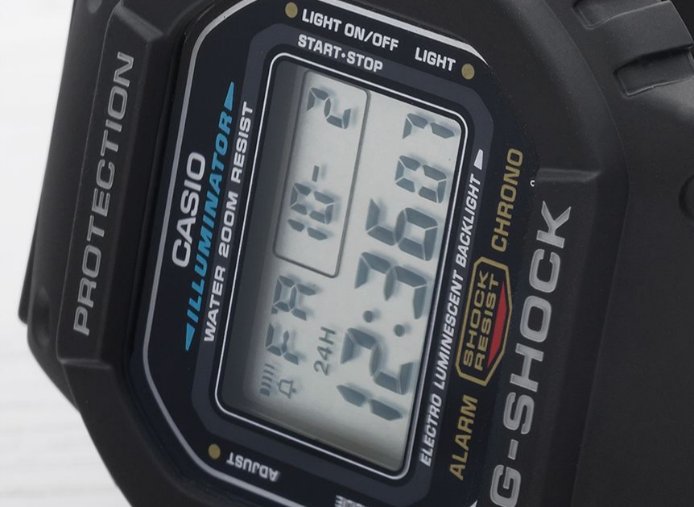
</div>

After a lot of digging, I finally found a [paper](https://www.researchgate.net/publication/3453662_Transflective_Liquid_Crystal_Displays) that mentions it, complete with a diagram.

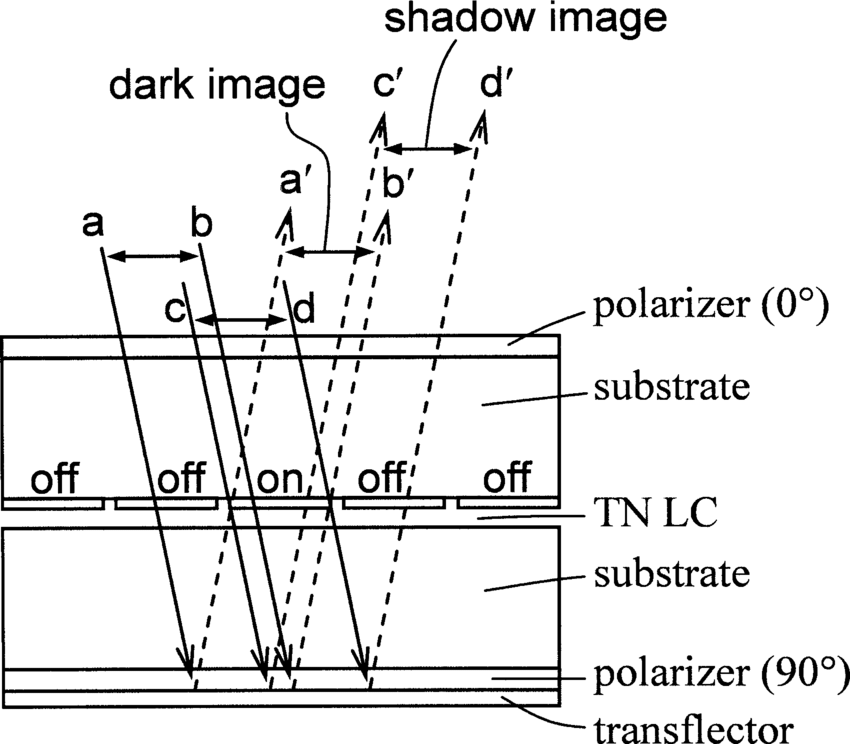

Interestingly, I also noticed something similar in Cyberpunk 2077. The interactive, world-space UI screens have a futuristic interpretation of this phenomenon. Instead of the shadow being cast by the substrate, it looks like the image emitted by the substrate is reflecting between two shiny inner surfaces of a transparent material. Very cool!

<div class="grid grid-cols-2 sm:grid-cols-2 my-4">
  
  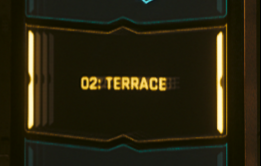
</div>

It’s really reminiscent of those infinite mirror effects you often see at exhibitions.

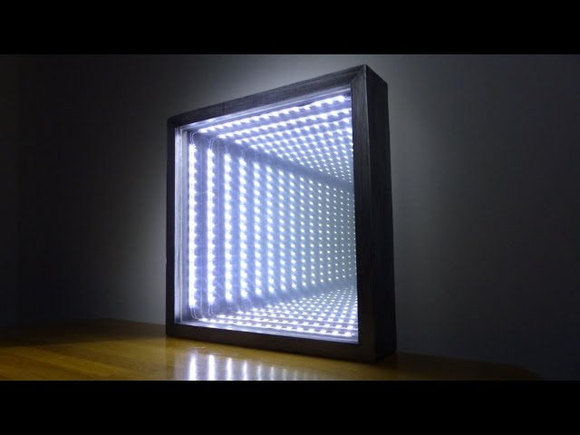
That got me wondering, have screens ever been embedded into these infinity mirror setups?


Turns out, someone has! In principle, it’s pretty much the same effect seen in Cyberpunk. Anyway, I thought it was interesting. Now, let’s get back on track...

---
So the key componenets of the shader are...
- **Substrate**
  - Visible pixel matrix.
  - Dark image casts a shadow image on the transflector.
  - When inactive, the substrate is not totally transparent.

- **Transflector**
  - Specular shimmer.
  - Steep specular falloff, low IOR.
  - LCD housing casts shadow onto the transflector.

- **Backlight**
  - Unique diffusion pattern.
  - Uneven diffusion of light.

# The Shader
This is the whole shader, it is definatley not the most elegant thing I have put together but I will break it down the best I can. The project can be downloaded [here](#github-repository) if you want to follow along in godot. 

```cpp
shader_type spatial;

uniform sampler2D viewport_texture : hint_default_black, filter_nearest_mipmap, repeat_disable;
uniform vec2 scale_texture = vec2(1.0, 1.0);
uniform vec2 translate_texture = vec2(0.0, 0.0);

uniform vec4 back_color: source_color = vec4(0.0);
uniform sampler2D back_noise : hint_default_transparent;
uniform float back_noise_scale = 1.;
uniform vec2 back_roughness_remap = vec2(0.0,1.0);

uniform vec4 substrate_color: source_color = vec4(0.0);
uniform vec4 substrate_shadow_color: source_color = vec4(0.0);

uniform vec4 fade_color: source_color = vec4(0.0);
uniform float fade_falloff = 0.55;

uniform sampler2D frame_shadow_map : hint_default_black, repeat_disable;
uniform vec4 frame_shadow_color: source_color = vec4(0.0);


uniform bool enable_backlight = false;
uniform sampler2D backlight_map : hint_default_black;
uniform vec2 backlight_remap = vec2(0.0, 1.);
uniform vec4 backlight_color: source_color = vec4(0.0);
uniform float backlight_emmission_strength: hint_range(0.0, 2.0)  = 0.0;
uniform float backlight_edge_bleed_strength : hint_range(0.0, 1.0) = 0.0;
uniform float backlight_bleed_strength : hint_range(0.0, 1.0) = 0.0;

uniform float depth : hint_range(0.0, 1.0) = 0.1;
uniform float normal_depth = 1.0;
uniform float specular : hint_range(0.0, 1.0) = 1.0;

uniform sampler2D clear_coat_roughness_map : hint_default_black;
uniform sampler2D clear_coat_normal_map : hint_normal;
uniform float clear_coat_normal_depth : hint_range(0.0, 1.0) = 1.0;
uniform vec4 clear_coat_dirt_color: source_color = vec4(0.0);
uniform vec2 clear_coat_dirt_remap = vec2(0.0, 0.2);
uniform float clear_coat_specular : hint_range(0.0, 1.0) = 1.0;
uniform vec2 clear_coat_roughness_remap = vec2(0.0, 0.2);

uniform float screen_width = 108.0;
uniform float screen_height = 77.0;

uniform vec2 bias = vec2(0.0, 0.0);

varying vec3 ro;
varying vec3 p;
varying vec3 vertex_normal_ws;

void vertex()
{
	p = ((MODEL_MATRIX)*vec4(VERTEX,1.0)).xyz;// Get fragment position in world space coordinates
	vertex_normal_ws = ((MODEL_MATRIX)*vec4(NORMAL,1.0)).xyz;
}

float grid(vec2 st)
{
	float v_line = abs((fract(st.x * screen_width) - 0.5) * 2.0);
	float h_line = abs((fract(st.y * screen_height) - 0.5) * 2.0);

	float grid = max(v_line, h_line);
	grid = smoothstep(0.80, 1, grid);
	return 1.0 - clamp(grid, 0., 1.);
}


float grid_custom_smoothstep(vec2 st, vec2 edges)
{
	float v_line = abs((fract(st.x * screen_width) - 0.5) * 2.0);
	float h_line = abs((fract(st.y * screen_height) - 0.5) * 2.0);

	float grid = max(v_line, h_line);
	grid = smoothstep(edges.x, edges.y, grid);
	return 1.0 - clamp(grid, 0., 1.);
}

float box(vec2 u, vec2 v)
{
	vec2 d = abs(u) - v;
	return length(max(d, 0.0)) + min(max(d.x, d.y), 0.0);
}

float calc_screen_rect_mask(vec2 uv)
{
	return 1.0 - smoothstep(0.-0.001, 0.+0.001, box((uv -0.5) * 2.0, vec2(1.0, 1.0)));
}

float calc_substrate_shadow(vec2 uv)
{
	float shadow_mask = 1.0 - smoothstep(0.-0.001, 0.+0.001, box((uv -0.5) * 2.0, vec2(1.0, 1.0)));
	return texture(viewport_texture, uv).r * grid(uv) * calc_screen_rect_mask(uv);
}

float calc_substrate(vec2 uv)
{
	return texture(viewport_texture, uv).r * grid(uv) * calc_screen_rect_mask(uv);
}


float calc_substrate_bleed(vec2 uv, vec2 edges)
{
	return texture(viewport_texture, uv).r * grid_custom_smoothstep(uv, edges) * calc_screen_rect_mask(uv);
}

float calc_frame_shadow(vec2 uv)
{
	return texture(frame_shadow_map, uv).r;
}

vec2 back_project_offset(vec3 camera_position)
{
	vec3 rd = normalize(p - camera_position) * depth * 0.1;
	vec2 offset = rd.xy + bias;
	offset.y *= -1.0;
	return offset;
}

vec2 scale_from_center(vec2 uv, vec2 scale)
{
	vec2 st = uv * scale;
	return st + vec2(0.5) - (scale * 0.5);
}

void fragment(){
	vec2 st = scale_from_center(UV, scale_texture) + translate_texture;
	vec3 view_space_position = (vec4(p, 1.0) * VIEW_MATRIX).xyz;

	vec2 offset = back_project_offset(CAMERA_POSITION_WORLD);
	float screen_mask = calc_screen_rect_mask(st);
	float substrate =  calc_substrate(st);
	float substrate_shadow =  calc_substrate_shadow(st + offset);

	vec3 color = vec3(0.0);
	color = mix(color, back_color.rgb, back_color.a);
	color = mix(color, back_color.rgb, back_color.a);
	color = mix(color, fade_color.rgb, (1.0 - dot(NORMAL, CAMERA_DIRECTION_WORLD)) * fade_falloff);

	if (!enable_backlight)
	{
		color = mix(color, substrate_shadow_color.rgb, substrate_shadow * substrate_shadow_color.a);
	}
	
	color = mix(color, substrate_color.rgb, screen_mask * grid(st) * 0.2);
	color = mix(color, substrate_color.rgb, substrate * substrate_color.a);
	
	if (!enable_backlight)
	{
		color = mix(color, frame_shadow_color.rgb, calc_frame_shadow(UV + offset - (vec2(bias.x, bias.y*-1.)*0.5)) * frame_shadow_color.a);
	}
	
	color = mix(color, clear_coat_dirt_color.rgb, smoothstep(clear_coat_dirt_remap.x, clear_coat_dirt_remap.y, texture(clear_coat_roughness_map, UV).r) * clear_coat_dirt_color.a);

	// -----------------
	// Final Output
	// -----------------

	ALBEDO = color;
	
	if (enable_backlight)
	{
		EMISSION = vec3(backlight_color.rgb
		* smoothstep(backlight_remap.x, backlight_remap.y, texture(backlight_map, scale_from_center(UV, vec2(.98)) + offset).r)
		* backlight_emmission_strength*4.
		* clamp(
			(1.0 - min(calc_substrate_bleed(st, vec2(1. - backlight_edge_bleed_strength, 1.0 + backlight_edge_bleed_strength)) * (1.- backlight_bleed_strength * 0.1), substrate) ) + backlight_bleed_strength * 0.1,
			0.0, 1.0));
	}

	if (enable_backlight)
	{
		SPECULAR = max((1.0 - substrate), (1.0 - screen_mask * grid(st)))  * specular;
	}
	else
	{
		SPECULAR = max((1.0 - substrate), (1.0 - screen_mask * grid(st))) - calc_frame_shadow(UV + offset - (vec2(bias.x, bias.y*-1.)*0.5))  * specular;
	}

	ROUGHNESS = smoothstep(back_roughness_remap.x, back_roughness_remap.y, texture(back_noise, UV*back_noise_scale + offset).r);

	NORMAL_MAP = texture(clear_coat_normal_map, UV).rgb;
	NORMAL_MAP_DEPTH = clear_coat_normal_depth;
	METALLIC = smoothstep(0.1, 1.0, 1.0 - substrate) * 0.45;
	CLEARCOAT = clear_coat_specular;
	CLEARCOAT_ROUGHNESS = smoothstep(clear_coat_roughness_remap.x, clear_coat_roughness_remap.y,texture(clear_coat_roughness_map, UV).r);
}
```

## Substrate Pixels
### Subviewport Texture
In godot I have the snake game rendering to [subviewport](https://docs.godotengine.org/en/stable/classes/class_subviewport.html) which can be sampled as a texture in the shader.

<div class="grid sm:grid-cols-2 my-4">
  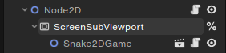
  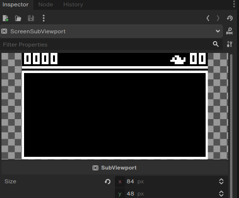
</div>

A `sampler2D` uniform is declared which the subviewport can be now selected as the texture in the inpector of the shader instance (material). 

```cpp
uniform sampler2D viewport_texture : hint_default_black, filter_nearest_mipmap, repeat_disable;
```
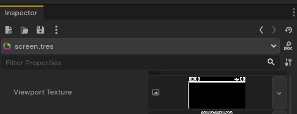

Since textures are sampled as if they are square, the uv is scaled such that the dimensions of are 84px x 48px. So I have 2 more uniforms `scale_texture` and `translate_texture` as input to do that.

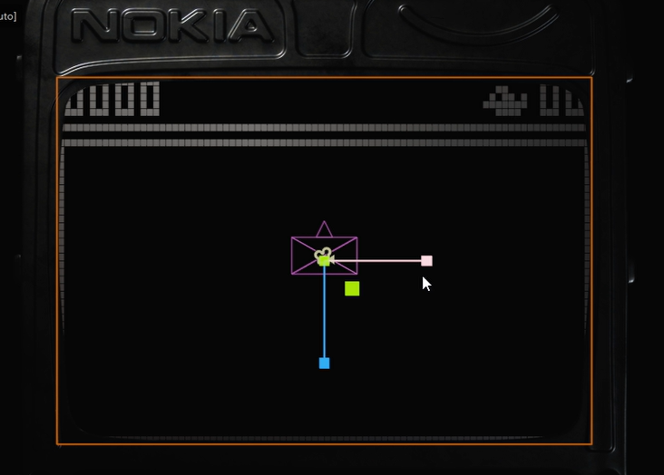

<div class="mt-2 mb-6 text-center text-opacity-50 text-zinc-50 italic text-sm"> 
Note: Ignore the pixel gridlines for now, I will get to them.
</div>  


```cpp
uniform vec2 scale_texture = vec2(1.0, 1.0);
uniform vec2 translate_texture = vec2(0.0, 0.0);

vec2 scale_from_center(vec2 uv, vec2 scale)
{
	vec2 st = uv * scale;
	return st + vec2(0.5) - (scale * 0.5);
}

float calc_substrate(vec2 uv)
{
	return texture(viewport_texture, uv).r * grid(uv) * calc_screen_rect_mask(uv);
}

void fragment() {
  vec2 st = scale_from_center(UV, scale_texture) + translate_texture;
  float substrate =  calc_substrate(st);
  ALBEDO = vec4(substrate, 1.0f);
}

```
These are the values I found that scaled the texture to the right dimensions for the quad I was using.

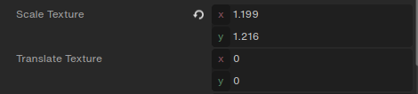
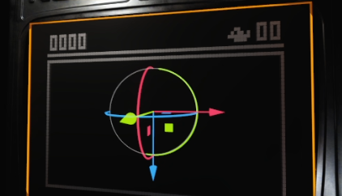

---
### Pixel Gridlines and Color

The lines are made by masking in the pixels using `grid(st)`, each pixel is defined as a square which is calculated using a simple distance function which is reapeated with `fract()`. 
We combine grid and viewport texture together create mask for mixing the desired substrate color in.
```cpp
uniform vec4 substrate_color: source_color = vec4(0.0);

//...

float grid(vec2 st)
{
	float v_line = abs((fract(st.x * screen_width) - 0.5) * 2.0);
	float h_line = abs((fract(st.y * screen_height) - 0.5) * 2.0);

	float grid = max(v_line, h_line);
	grid = smoothstep(0.80, 1, grid);
	return 1.0 - clamp(grid, 0., 1.);
}

float calc_substrate(vec2 uv)
{
	return texture(viewport_texture, uv).r * grid(uv) * calc_screen_rect_mask(uv);
}

//...

void fragment() {
	vec2 st = scale_from_center(UV, scale_texture) + translate_texture;
	float substrate =  calc_substrate(st);

	//... Background Transflector ...

	color = mix(color, substrate_color.rgb, screen_mask * grid(st) * 0.2); 	// Inactive Pixels
	color = mix(color, substrate_color.rgb, substrate * substrate_color.a); // Active Pixels
	// ...
}
```

**Subviewport Texture**
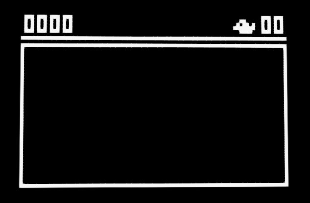

**Grid**
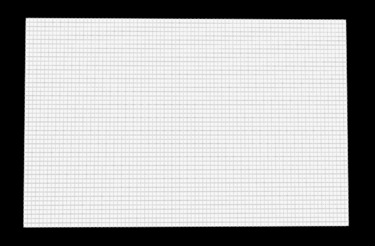

**Grid and Subviewport Texture**
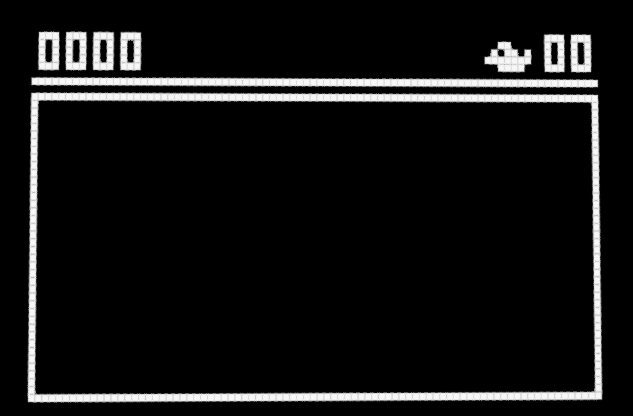

**Mix Substrate Color**
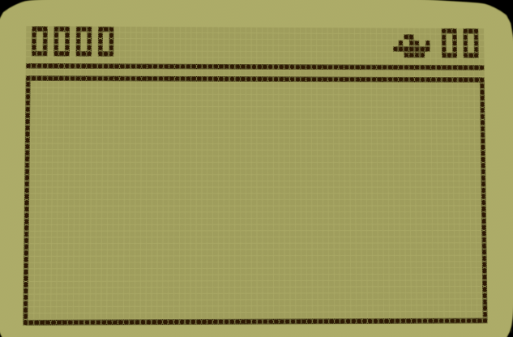

## Substrate Shadow
Currently the display looks rather flat. In the reference, the lcd substrate casts shadows onto the transflector. We can fake a deeper layer using a simple parralax function. It simply returns a 2D offset which we can use the sample the subviewport texture.

```cpp
//...
uniform float depth : hint_range(0.0, 1.0) = 0.1;
uniform vec2 bias = vec2(0.0, 0.0);
//...

varying vec3 ro;
varying vec3 p;
varying vec3 vertex_normal_ws;

void vertex()
{
	p = ((MODEL_MATRIX)*vec4(VERTEX,1.0)).xyz; // Get fragment position in world space coordinates
}

vec2 back_project_offset(vec3 camera_position)
{
	vec3 rd = normalize(p - camera_position) * depth * 0.1;
	vec2 offset = rd.xy + bias;
	offset.y *= -1.0;
	return offset;
}

float calc_substrate_shadow(vec2 uv)
{
	float shadow_mask = 1.0 - smoothstep(0.-0.001, 0.+0.001, box((uv -0.5) * 2.0, vec2(1.0, 1.0)));
	return texture(viewport_texture, uv).r * grid(uv) * calc_screen_rect_mask(uv);
}


//...

void fragment() {
	vec2 offset = back_project_offset(CAMERA_POSITION_WORLD);
	float substrate_shadow =  calc_substrate_shadow(st + offset);

	vec3 color = vec3(0.0);

	// ...

	if (!enable_backlight)
	{
		color = mix(color, substrate_shadow_color.rgb, substrate_shadow * substrate_shadow_color.a);
	}
	//...
}
```

We first get the unit vector between the camera postion and the surface positions `rd`. We extract the `x` and `y` components to determine how much to shift the shadow for the parralax effect. We invert the y component `-y` to correct the direction. Additonally we add a `bias` and `depth` uniform floats to help control the effect's strength. This isn't the most robust parralax effect, especially when you trying to convey deep layers, however since this shadow is very shallow we can get away with this approximation.

```cpp
vec3 rd = normalize(p - camera_position) * depth * 0.1;
vec2 offset = rd.xy + bias;
offset.y *= -1.0;
```


Then we just sample the same substrate but with the co-ordinates offsetted by the `back_project_offset`, this achieves the parralaxed effect.

```cpp
float calc_substrate_shadow(vec2 uv)
{
	float shadow_mask = 1.0 - smoothstep(0.-0.001, 0.+0.001, box((uv -0.5) * 2.0, vec2(1.0, 1.0)));
	return texture(viewport_texture, uv).r * grid(uv) * calc_screen_rect_mask(uv);
}
```

<video class="mx-auto mt-4 mb-4" width=420px autoplay loop muted playsinline>
	<source src="substrate_parralax_no.webm" type="video/webm">
</video>
<div class="mt-2 mb-6 text-center text-opacity-50 text-zinc-50 italic text-sm"> 
Without Substrate Shadow
</div>  

<video class="mx-auto mt-2 mb-4" width=420px autoplay loop muted playsinline>
	<source src="substrate_parralax.webm" type="video/webm">
</video>
<div class="mt-2 mb-6 text-center text-opacity-50 text-zinc-50 italic text-sm"> 
With Substrate Shadow (Kinda hard to see bcs video compression)
</div>  
<video class="mx-auto mt-2 mb-4" width=420px autoplay loop muted playsinline>
	<source src="substrate_shadow_parralax_bw.webm" type="video/webm">
</video>
<div class="mt-2 mb-6 text-center text-opacity-50 text-zinc-50 italic text-sm"> 
With Substrate Shadow (BW and high contrast to better see the effect)
</div>  


## Transflector Shimmer
Looking at the reference images of the transflector. It is diffuse yet it slightly shimmers in the light. 

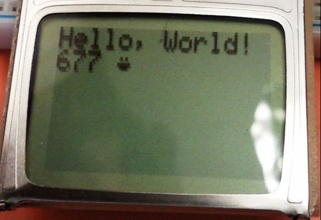

Also notice that when the light angle is steep the energy being recieved back to the camera terminates quickly, similar to the metal frame. We can guess that the fresnel IOR is somewhat low.
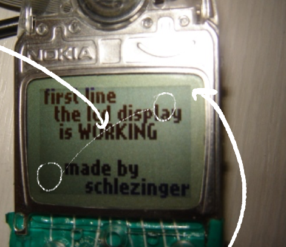

I found that using bluenoise for BRDF roughness input appoximates the shimer effect quite well and increased the metalic contribution to lower the IOR of the material. Godot doesn't expose the IOR so making the material metalic is bit of a hack.

<div class="grid my-4 gap-2 grid-cols-2 sm:grid-cols-2 w-96 mx-auto">
<div>
	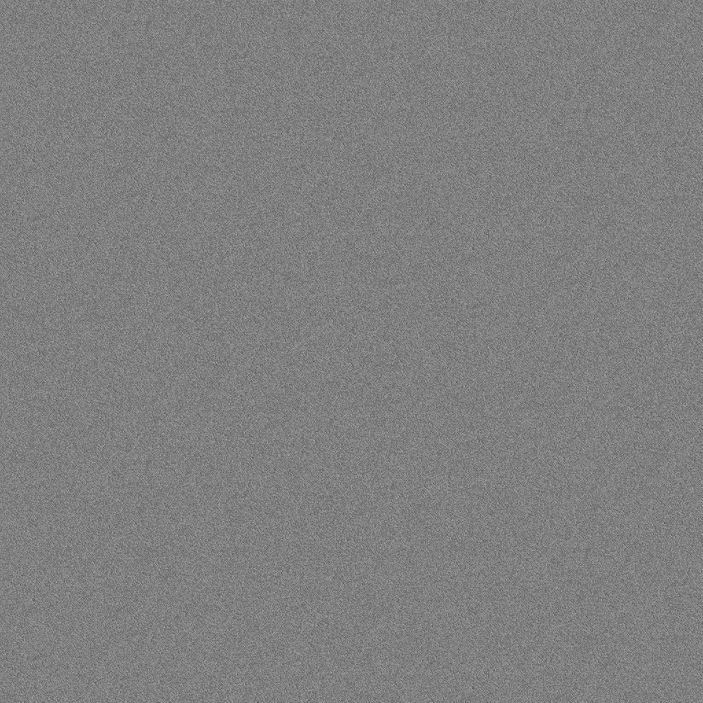
	<div class="w-full text-center">Bluenoise Greyscale</div>
</div>
<div>
	
	<div class="w-full text-center">Bluenoise Normals</div>
</div>
</div>

```cpp
ROUGHNESS = smoothstep(back_roughness_remap.x, back_roughness_remap.y, texture(back_noise, UV*back_noise_scale + offset).r);
METALLIC = smoothstep(0.1, 1.0, 1.0 - substrate) * 0.6;
```
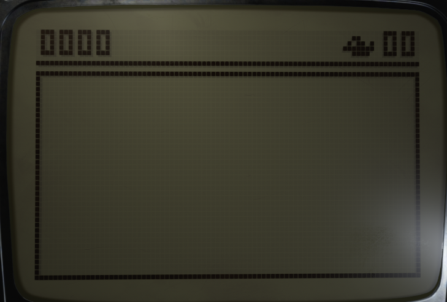
<div class="mt-2 mb-6 text-center text-opacity-50 text-zinc-50 italic text-sm"> 
Without roughness and metalic modifications.
</div>  

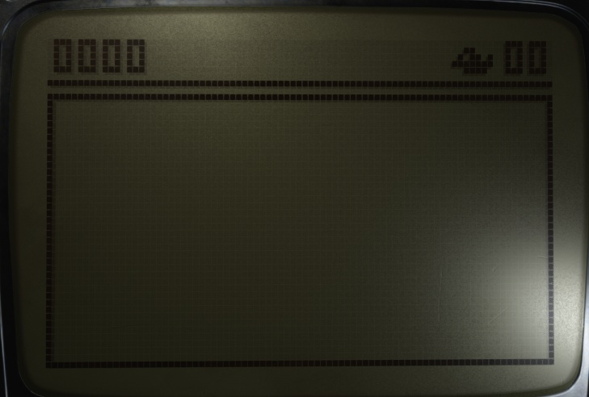
<div class="mt-2 mb-6 text-center text-opacity-50 text-zinc-50 italic text-sm"> 
With roughness and metalic modifications.
</div>  

## Transflector Housing Frame Shadow
Godot's shadows are rendered using shadowmaps. One of the painpoints of shadowmaps is that they can introduce aliasing or lack of accuracy with insuffeicnt resolution and filtering. 

Instead of relying on shadowmaps to capture the LCD's display housing geometry, I cheated and use a texture to create the shadow map. I project it onto the transflector as its the furthest back layer. 

```cpp
float calc_frame_shadow(vec2 uv)
{
	return texture(frame_shadow_map, uv).r;
}

color = mix(color, frame_shadow_color.rgb, 
			calc_frame_shadow(UV + offset - (vec2(bias.x, bias.y*-1.)*0.5)) 
			* frame_shadow_color.a);
```


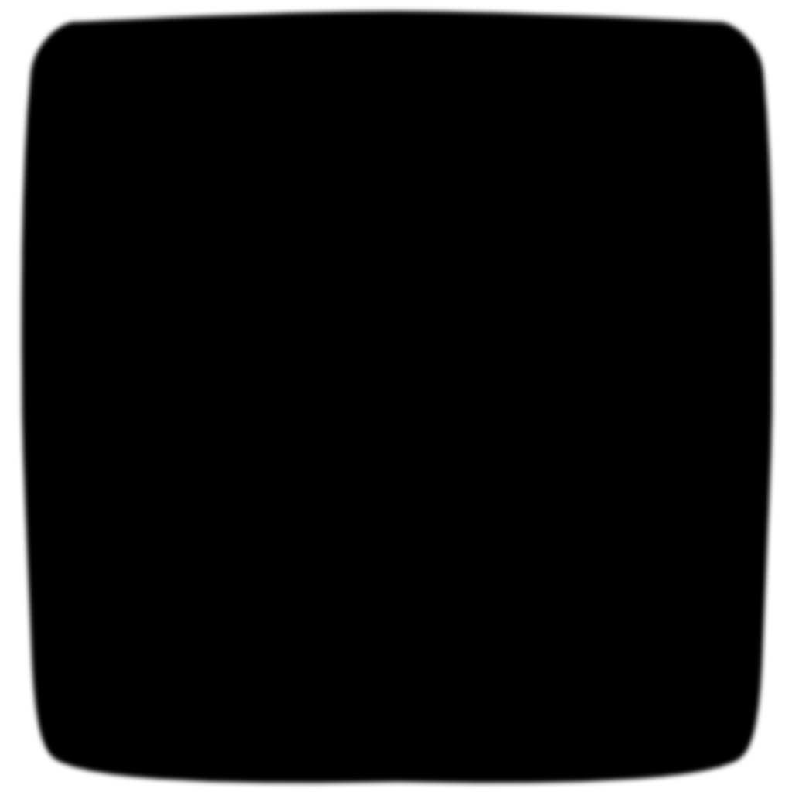
<div class="w-full text-center mb-6">Frame Shadow Texture</div>


<div class="mt-2 mb-6 text-center text-opacity-50 text-zinc-50 italic text-sm"> 
No frame shadow texture.
</div> 


<div class="mt-2 mb-6 text-center text-opacity-50 text-zinc-50 italic text-sm"> 
With frame shadow texture.
</div>  

Now there is fake contact shadows but notice at the top left that the specular is responding incorrectly, the specular construbition can simply be masked out using the shadow texture. 

```cpp
SPECULAR = max((1.0 - substrate), (1.0 - screen_mask * grid(st))) - calc_frame_shadow(UV + offset - (vec2(bias.x, bias.y*-1.)*0.5)) * specular;
```


<div class="mt-2 mb-6 text-center text-opacity-50 text-zinc-50 italic text-sm"> 
Modified specular.
</div>  

This contact shadow makes a big difference, now the frame actaully looks like it sits on top of the screen.

## Backlight
Last thing to address is the backlight. Looking at reference images, backlights then were not very uniform. I guess it wasn't such a big deal when this phone came out?


 Anyways I use a texture to mask areas where I want the material to be emmisive.


<div class="w-full text-center mb-6">Backlight Mask Texture</div>

```cpp
EMISSION = vec3(backlight_color.rgb
		* smoothstep(backlight_remap.x, backlight_remap.y, texture(backlight_map, scale_from_center(UV, vec2(.98)) + offset).r)
		* backlight_emmission_strength*4.
		* clamp(
			(1.0 - min(calc_substrate_bleed(st, vec2(1. - backlight_edge_bleed_strength, 1.0 + backlight_edge_bleed_strength)) * (1.- backlight_bleed_strength * 0.1), substrate) ) + backlight_bleed_strength * 0.1,
			0.0, 1.0));
```

The extra smoothstep and clamp functions are there to introduce a bit of light bleed around each pixel when the backlight is on. Its also important to add `if` cases to swithch on/off the effect and disable effects that don't make sense when the backlight is on, like the shadows.

```cpp

if (!enable_backlight)
{
	color = mix(color, substrate_shadow_color.rgb, substrate_shadow * substrate_shadow_color.a);
}

//...

if (!enable_backlight)
{
	color = mix(color, frame_shadow_color.rgb, calc_frame_shadow(UV + offset - (vec2(bias.x, bias.y*-1.)*0.5)) * frame_shadow_color.a);
}

// ...

if (enable_backlight)
{
	EMISSION = vec3(backlight_color.rgb
	* smoothstep(backlight_remap.x, backlight_remap.y, texture(backlight_map, scale_from_center(UV, vec2(.98)) + offset).r)
	* backlight_emmission_strength*4.
	* clamp(
		(1.0 - min(calc_substrate_bleed(st, vec2(1. - backlight_edge_bleed_strength, 1.0 + backlight_edge_bleed_strength)) * (1.- backlight_bleed_strength * 0.1), substrate) ) + backlight_bleed_strength * 0.1,
		0.0, 1.0));
}

if (enable_backlight)
{
	SPECULAR = max((1.0 - substrate), (1.0 - screen_mask * grid(st)))  * specular;
}
else
{
	SPECULAR = max((1.0 - substrate), (1.0 - screen_mask * grid(st))) - calc_frame_shadow(UV + offset - (vec2(bias.x, bias.y*-1.)*0.5))  * specular;
}

```


## Results

<video autoplay loop muted playsinline >
  <source src="thumbnail.webm" type="video/webm">
</video>


# Github Repository

I hope to work this project into a Nokia Emulator at some point, the code isn't super cute but if you wanna try it for yourself in Godot you can. 

https://github.com/AustinMaddison/Nokia-Sim/tree/master


# References

[Zhu, Xinyu & Ge, Zhibing & Wu, Thomas & Wu, Shin-Tson. (2005). Transflective Liquid Crystal Displays. Display Technology, Journal of. 1. 15 - 29. 10.1109/JDT.2005.852506.](https://www.researchgate.net/publication/3453662_Transflective_Liquid_Crystal_Displays)  

[Godot Shader Language Reference](https://docs.godotengine.org/en/stable/tutorials/shaders/shader_reference/shading_language.html)