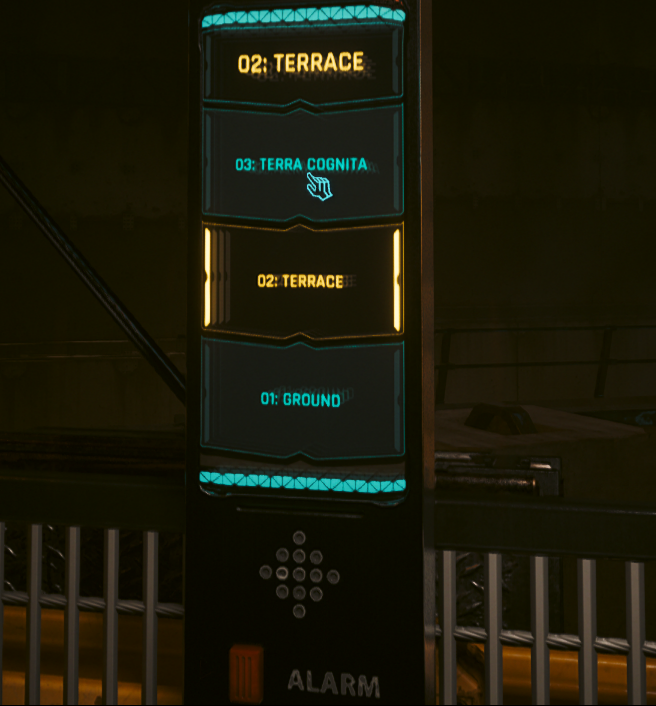

{}

<video autoplay loop muted playsinline >
  <source src="thumbnail.webm" type="video/webm">
</video>

I have always been fascinated by how different materials respond under various conditions, and LCDs are no exception. A friend recommended that I try a relatively new game engine on the block, [Godot 4.3](https://godotengine.org/releases/4.3/). During my summer break, I decided to give its shader authoring system and rendering features a spin.

I aimed to recreate the iconic Snake game from Nokia phones but in 3D. To achieve this, I knew I had to craft an authentic-looking LCD screen; otherwise, it just wouldn't feel right. More specifically, I wanted to simulate a monochrome passive matrix LCD.

# Gathering Reference
The LCD I wanted to emulate belonged to the Nokia 3310. I gathered a bunch of reference images off the internet to understand all the nuances this specific phone screen had.

I collected images the nokia device, the snake game and the isolated screen module with and without the backlight on. Thankfully the community of tinkerers in the past have documented lots of images of this LCD.

## Visual Features
These are the key visual features I’ve spotted that are essential for portraying this LCD as faithfully as possible.

I’ve been curious if anyone has formally written about a visual phenomenon I noticed shadows cast by the substrate onto the transflector. I remember seeing the same effect on my G-Shock as a kid.

 

After a lot of digging, I finally found a [paper](https://www.researchgate.net/publication/3453662_Transflective_Liquid_Crystal_Displays) that mentions it, complete with a diagram.

Interestingly, I also noticed something similar in Cyberpunk 2077. The interactive, world-space UI screens have a futuristic interpretation of this phenomenon. Instead of the shadow being cast by the substrate, it looks like the image emitted by the substrate is reflecting between two shiny inner surfaces of a transparent material. Very cool!

  
  

It’s really reminiscent of those infinite mirror effects you often see at exhibitions.

That got me wondering, have screens ever been embedded into these infinity mirror setups?

Turns out, someone has! In principle, it’s pretty much the same effect seen in Cyberpunk. Anyway, I thought it was interesting. Now, let’s get back on track...

---
So the key componenets of the shader are...
- **Substrate**
  - Visible matrix grid.
  - Dark image casts a shadow image on the transflector.
  - When inactive, the substrate is not totally transparent.

- **Transflector**
  - Shimmers.
  - Steep lighting falloff, low IOR.
  - LCD housing casts shadow onto the transflector.

- **Backlight**
  - Unique diffusion pattern.
  - Uneven diffusion of light.

# The shader

## Substrate Active Area

## Substrate Grid

## Substrate Shadow

## Transflector Shimmer

## Transflector Housing Frame Shadow

# Contact Shadow

## Transflector

# Backlight Sparkle

# Backlight

# Imperfection Top Coat

# Github Repository

https://github.com/AustinMaddison/Nokia-Sim/tree/master

# References
Zhu, Xinyu & Ge, Zhibing & Wu, Thomas & Wu, Shin-Tson. (2005). Transflective Liquid Crystal Displays. Display Technology, Journal of. 1. 15 - 29. 10.1109/JDT.2005.852506. 