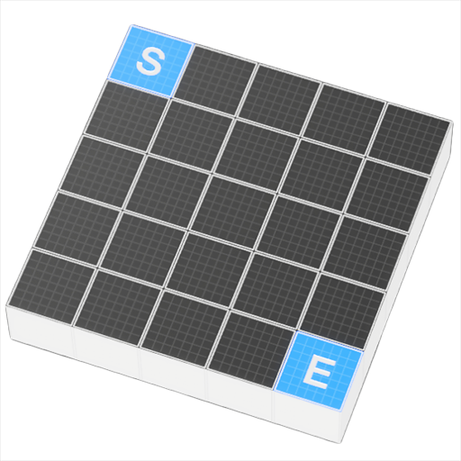
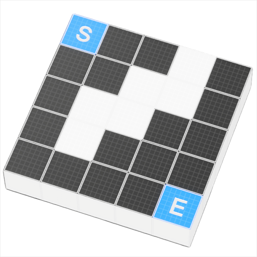
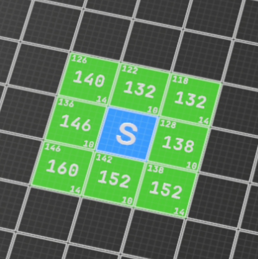
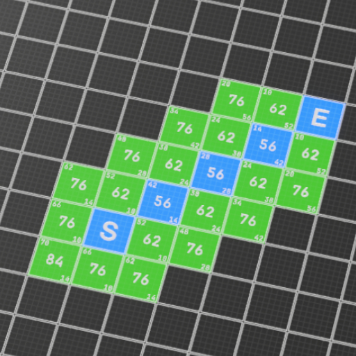
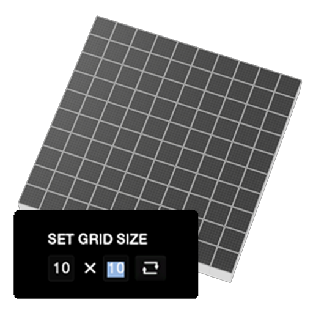
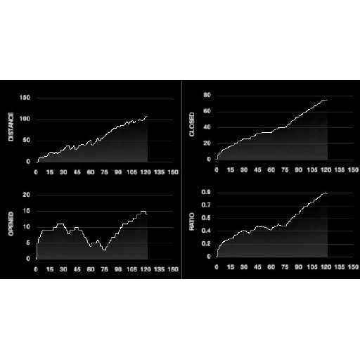
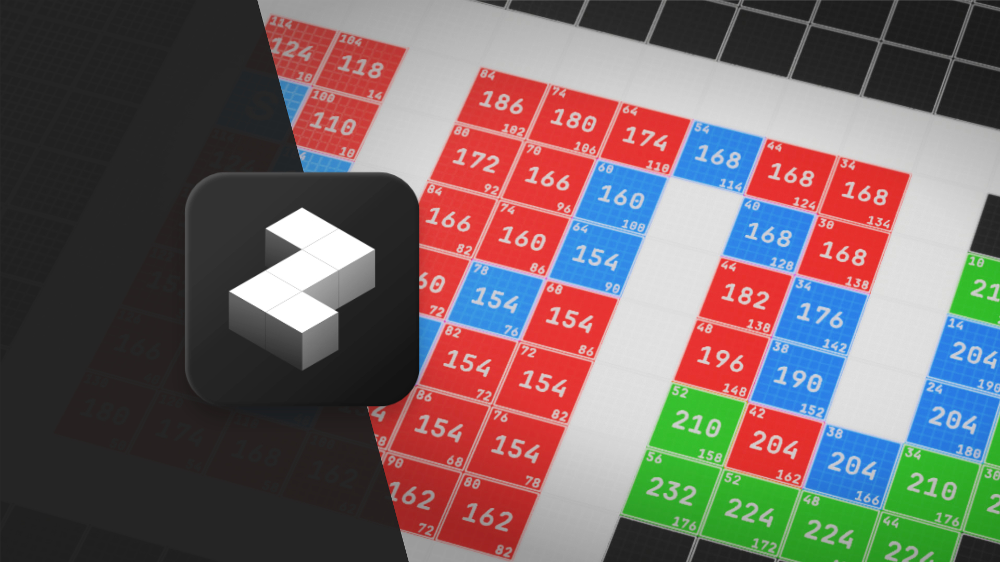

{}

<iframe class="w-full" height="360px" src="https://www.youtube.com/embed/KV5Zm-LCf6M?si=Ml-C8CoDPRSVb0f" title="YouTube video player" frameborder="0" allow="accelerometer; autoplay; clipboard-write; encrypted-media; gyroscope; picture-in-picture; web-share" referrerpolicy="strict-origin-when-cross-origin" allowfullscreen></iframe>

<div class="mb-8"> </div>


I made this cute program for a maths course (Heuristic Optimization) project for teaching purposes. I wanted an interactive way to demonstrate the behaviour of different pathfinding algorithms. Also it gave me the oppotunity to learn each algorithms through implementation. 

It has some usability/performance quirks, but for my use case it was more than good enough. 

### Download

[Visual Pathfinder - Release V0.1.0](https://github.com/AustinMaddison/Pathfinding-Visualizer/releases/tag/v0.1.0)


## Features


<div class="grid sm:grid-cols-2 lg:grid-cols-3 gap-y-4 gap-x-4 ">
    <div class="hover:border-opacity-40
  transition duration-300 bg-zinc-950 backdrop-blur-xl bg-opacity-80 border-spacing-2 border-1 border-zinc-50 border-opacity-20 p-4">
        <div class="font-medium text-lg mb-2">
        Set start and end
        </div>
        
    </div>
    <div class="hover:border-opacity-40
  transition duration-300 min-w-full bg-zinc-950 backdrop-blur-xl bg-opacity-80 border-spacing-2 border-1 border-zinc-50 border-opacity-20 p-4">
        <div class="font-medium text-lg mb-2">
        Paint obstacles
        </div>
        
    </div>
    <div class="hover:border-opacity-40
  transition duration-300 min-w-full bg-zinc-950 backdrop-blur-xl bg-opacity-80 border-spacing-2 border-1 border-zinc-50 border-opacity-20 p-4">
        <div class="font-medium text-lg mb-2">
        Run single step
        </div>
        
    </div>
    <div class="hover:border-opacity-40
  transition duration-300 min-w-full bg-zinc-950 backdrop-blur-xl bg-opacity-80 border-spacing-2 border-1 border-zinc-50 border-opacity-20 p-4">
        <div class="font-medium text-lg mb-2">
        Run continously
        </div>
        
    </div>
        <div class="hover:border-opacity-40
  transition duration-300 min-w-full bg-zinc-950 backdrop-blur-xl bg-opacity-80 border-spacing-2 border-1 border-zinc-50 border-opacity-20 p-4">
        <div class="font-medium text-lg mb-2">
        Resize grid
        </div>
        
    </div>
    <div class="hover:border-opacity-40
  transition duration-300 min-w-full bg-zinc-950 backdrop-blur-xl bg-opacity-80 border-spacing-2 border-1 border-zinc-50 border-opacity-20 p-4 flex flex-col">
        <div class="font-medium text-lg mb-2">
        Change algorithm
        </div>
        <div class="flex flex-col justify-around grow py-2 font-normal opacity-80">
            <div class="text-center">Breadth First Search</div>
            <div class="text-center">Greedy Best First Search</div>
            <div class="text-center">Dijkstra's</div>
            <div class="text-center">A*</div>
        </div>
    </div>
    <div class="hover:border-opacity-40
  transition duration-300 min-w-full bg-zinc-950 backdrop-blur-xl bg-opacity-80 border-spacing-2 border-1 border-zinc-50 border-opacity-20 p-4">
        <div class="font-medium text-lg mb-2">
        Progress data
        </div>
        
    </div>
</div>

## Pathfinder Interface 

```cpp
using System.Collections;
using System.Collections.Generic;
using UnityEngine;

public interface PathfinderInterface
{
    void RunIteration();
    bool IsDone { get; }
    PathfinderStatus Status { get; }
    string ToString();
    HashSet<Node> OpenNodeSet{ get; }
    HashSet<Node> ClosedNodeSet{ get; }
    public int OpenNodesTotal { get; }
    public int ClosedNodesTotal { get; }

    int Distance{ get; }
}
```
Implementing this interface allows for many types of pathfinding algorithms to implemented for the visualizer.

You might of noticed that I have redundant varaibles `IsDone` and `PathfindderStatus` to store state. This is definatley somthing I want to change, and there is other things I want to improve on that I mention later [here](#future-plans).

---
Here is a example implementation of Drijksta's:
```cpp
using System.Collections;
using System.Collections.Generic;
using UnityEngine;

public class DijkstrasPathfinder: PathfinderInterface
{
    private string pathfinderName = "Dijkstra's";

    private Node nodeStart;
    private Node nodeEnd;
    Node nodeCurrent;

    private HashSet<Node> openNodeSet;
    private HashSet<Node> closedNodeSet;

    public PathfinderStatus Status { get; private set; }
    public bool IsDone { get; private set; }

    public DijkstrasPathfinder(Node nodeStart, Node nodeEnd)
    {
        this.nodeCurrent = null;
        this.nodeStart = nodeStart;
        this.nodeEnd = nodeEnd;

        openNodeSet = new HashSet<Node>();
        closedNodeSet = new HashSet<Node>();

        // Calculate startnode costs
        int h = PathfinderManager.Cost(nodeStart.Position, nodeEnd.Position);
        nodeStart.SetCost(0, h, h);

        // Start from start node.
        openNodeSet.Add(this.nodeStart);

        IsDone = false;
    }

    public override string ToString()
    {
        return pathfinderName;
    }

    public void RunIteration()
    {
        if (openNodeSet.Count == 0)
        {   
            IsDone = true;
            Debug.Log("Failed to find optimal path.");
            Status = PathfinderStatus.NO_PATH_FOUND;
            return;
        }
        
        // Find node with best f cost.
        nodeCurrent = openNodeSet.Min();
        openNodeSet.Remove(nodeCurrent);

        // Close the best node for potential best path.
        CloseNode(nodeCurrent);

        // Open neighbours for best node.
        OpenNeighbours(nodeCurrent);
    }

    private void OpenNeighbours(Node node)
    {
        foreach (Node neighbour in node.GetNeighbours())
        {
            if (neighbour.state != NodeState.OBSTACLE &&
                neighbour.state != NodeState.CLOSED &&
                neighbour.state != NodeState.START)
            {
                // Heuristic to choose best path
                int tentativeGScore = node.GCost + 
                    PathfinderManager.Cost(node.Position, neighbour.Position);

                int h = 0;
                int f = tentativeGScore + h;

                if (tentativeGScore < neighbour.GCost ||
                    neighbour.state != NodeState.OPEN)
                {
                    neighbour.CameFromNode = node;

                    // Found end
                    if (neighbour == nodeEnd)
                    {
                        neighbour.SetCost(tentativeGScore, h, f);

                        Debug.Log("Found optimal path.");
                        nodeCurrent = neighbour;
                        Status = PathfinderStatus.PATH_FOUND;
                        IsDone = true;
                        return;
                    }
  
                    neighbour.SetCost(tentativeGScore, h, f);

                    if (neighbour.state != NodeState.END)
                    {
                        neighbour.state = NodeState.OPEN;
                        neighbour.UpdateAppearance();
                    }
                    openNodeSet.Add(neighbour);
                }
            }
        }
    }

    private void CloseNode(Node node)
    {
        if (node.state != NodeState.START)
        {
            closedNodeSet.Add(node);
            node.state = NodeState.CLOSED;
            node.UpdateAppearance();
        }
    }

    public HashSet<Node> OpenNodeSet => openNodeSet;
    public HashSet<Node> ClosedNodeSet => closedNodeSet;
    public int OpenNodesTotal => openNodeSet.Count;
    public int ClosedNodesTotal => closedNodeSet.Count;
    public int Distance => nodeCurrent.GCost;
}
```

<!-- ## Behavior of Different Algorithms
### BFS


### Greedy


### Drijksta


### A*
 -->


## Future Plans

### UI/UX
Right now there is not much help in understanding how to use the program other than the keybindings shown at the bottom. What do the numbers on each node on the grid mean? There a lot of frequent questions users might have that could be answered with some more UI features. Also providing an indicator of what state the simulator is in and what tool is selected. 

### Performance
Would like to make the program more performant because currently it begins to chug for grid sizes larger than 100x100. I should take a more data orientated approach to the archetecture of the program. Also I should opitmize the data types and containers I used to store state, I think this can dramtically increase performance. 

There is this [video](https://www.youtube.com/watch?v=WwkuAqObplU&ab_channel=NicBarker) by Nic Barker that I really like on techniques on improving performance for interactive programs by using data-orientated approach. 

Lastly I should consider parallelization the algorithms as the neibour checks can be done independantly on different threads for each iteration.

## Code Repository
[GitHub Repository Link](https://github.com/AustinMaddison/Pathfinding-Visualizer/tree/master)


## References
P. E. Hart, N. J. Nilsson and B. Raphael, "A Formal Basis for the Heuristic Determination of Minimum Cost Paths," in IEEE
Transactions on Systems Science and Cybernetics, vol. 4, no. 2, pp. 100-107, July 1968, doi: 10.1109/TSSC.1968.300136.

Ruoqi He, Chia-Man Hung, “Pathfinding In 3d Space - A*, Theta*, Lazy Theta* In Octree Structure”, https://ascane.github.io/projects/07_pathfinding3d/report.pdf

Hybesis H.urna, “Pathfinding algorithms: the four Pillars.”, https://medium.com/@urna.hybesis/pathfinding-algorithms-the-four-pillars-1ebad85d4c6b