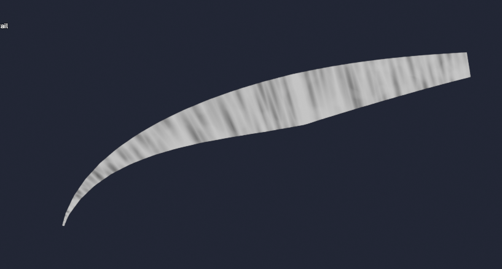
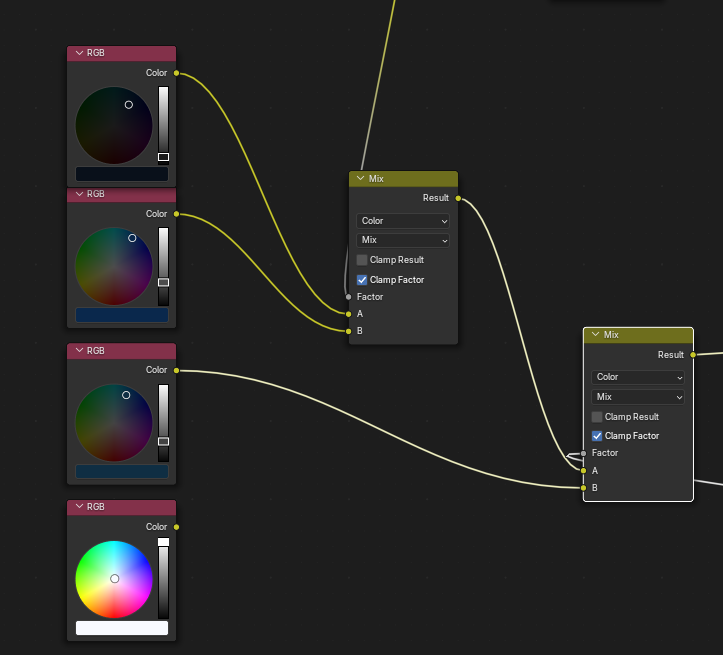

{}

<iframe src="https://player.vimeo.com/video/1047475777?h=d586fa63b6&amp;muted=1&amp;autoplay=1&amp;loop=1&amp;badge=0&amp;autopause=0&amp;player_id=0&amp;app_id=58479" frameborder="0" allow="autoplay; fullscreen; picture-in-picture; clipboard-write; encrypted-media" style="position:absolute;top:0;left:0;width:100%;height:100%;" title="Your Name Fan Art [Free Blender .blend Project File]"></iframe>

 

I bought a new laptop after wrapping up work for Bangkok Design Week. My 5-year-old laptop, equipped with a GTX 1050 and a 7th-generation i5, could no longer keep up. Eager to put my new machine to the test, I downloaded the latest version of Blender (version 4.1 at the time), found some inspiration, and got to work.

---

The shaders I created turned out to be surprisingly simple. Many of the components rely on remapping fractal and Voronoi noise. Thanks to Blender's shading system, all the noise textures I needed were readily available, making it easy to create the different elements. If these noise types weren’t implemented out of the box, the process would have been far more involved.

<mark>You can download the .blend file [here](#project-file) if you want to follow along!</mark>

# Breakdown

## Trail

#### Geometry
The trails are made from simple quad ribbons that that are shaped by splines. Splines are easy to manipulate to make the arcs in the trail. I also ensure their UVs are reasonably layed out so I can map colors and create shapes onto them. 

  
  

#### Color

I isolate vertical axis and map the purple, blue 'ish' gradient to like you find in the anime. I alos add some fractal noise to break up the uniformity.

  
  

#### Mask
Since the trail is UVed, to make a verical fade, again can isolate the vertical axis. We can use the vertical positions and remap them to new values to create streaks, like we did for the color gradient earlier.

  
  

To break up uniformity, I add some fractal noise. 

  
  

Then for the cool magical waves I used a vornoi noise but stretched vertically.

  
  

To animate the waves I used the python expression (field highlighted in purple) on the mapping nodes's translation `frame * 0.001` translate it along the horizontal direction overtime.

Then I combine back with the streaks to get this.

#### Combine
I mix the mask and the colors from earlier to get the final trail

## Sky

#### Simple Sky Gradient and Ring
Using blender's world shader, first I get the coordinates of the sky.

Then I apply some noise along an axis. This covers a whole hemisphere. 

  
  

A ramp is then used to limit the values to form a ring.

Lastly I mix the night sky blue colors to the greyscale mask made previously and from the sky vertical cooridinates.

#### Colored Stars
To create many randomly distrubuted dots of diifferent sizes and positions, I found inverted vornoi to be a good way to do this.

  
  

Since the stars are a little too unifrom, I clustered the stars using a mask. The mask again using scaled up fractal noise.  

Then to apply colors on the stars, multiplying colored noise made using fractal noise and a color ramp does the trick. 

#### Combine

Lastly mix the stars with the sky gradient made earlier.

## Clouds

#### Geometry
Used a modified uv sphere primitive to encompass the scene to render the clouds on. 

#### Base Noise
The base noise used to shape and color the clouds are made from 3 noises. 2 vornois with different scales and detailed 1 fractal noise.

  
  
  

The output of all these 3 noises mixed together

#### Shaping Clouds

Using the base the noise, shape of the clouds can be defined with a ramp.

#### Coloring Clouds
Similarly, to color the clouds, a color ramp was used to map the desired cloud colors onto the base noise.

#### Combine  

Lastly mask the colors out using the shape made earlier... 'tada', clouds.

## Compositing
For post-processing, I added lens-flares, color grades and added film grain in after effects. Made a 16x9 and 9x19 version for desktop and mobile phone wallpapers.

# Blender Project File (.blend)
https://github.com/AustinMaddison/Your-Name/releases/tag/V1

